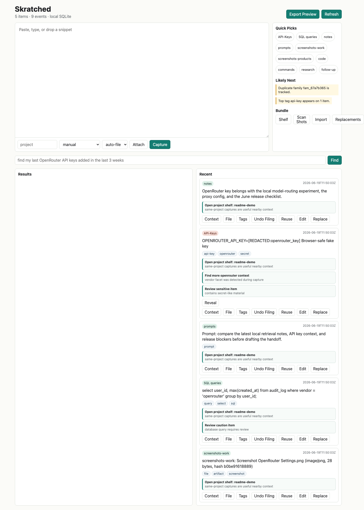
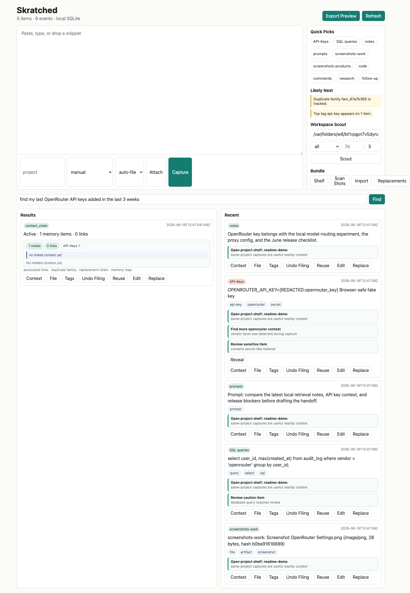
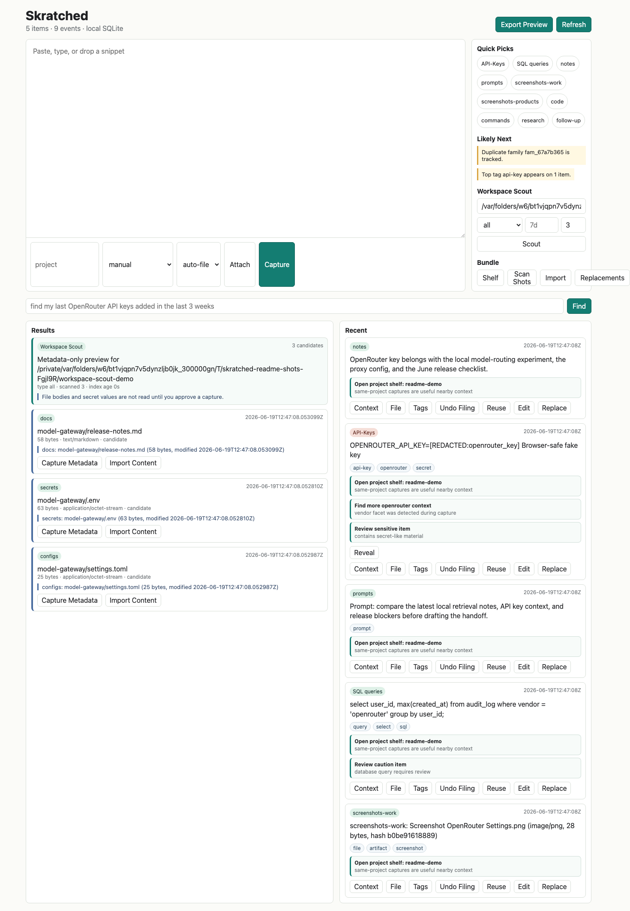
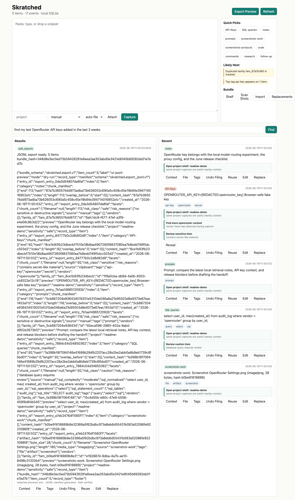

# Skratched

**A local-first experiential memory system for the work you keep losing in tabs, chats, terminals, screenshots, prompts, SQL, API keys, local project files, and half-finished notes.**

Skratched is not another blank notes app. It is a clean always-open scratchpad plus Workspace Scout: a local discovery layer that finds important files across user-approved roots before they disappear into sprawling project folders. Paste once, scout safely, keep context forever, and ask for the thing the way you remember it: "find my last OpenRouter API keys added in the last 3 weeks, and provide context of associated entries."

## Why Skratched Exists

Most knowledge tools make you choose between speed and structure.

- **Note apps** are flexible, but they depend on you naming, tagging, and organizing things while you are already busy.
- **Snippet managers** save code, but usually miss surrounding project context, screenshots, replacements, and safety state.
- **Password managers** protect secrets, but they are not built to remember the note, SQL query, prompt, screenshot, or terminal command that went with a key.
- **File search tools** can find changed files, but they usually stop at paths instead of turning discoveries into safe, redacted, reusable memory.
- **AI memory tools** can feel smart, but many depend on cloud sync, vector databases, opaque ranking, or raw content leaving the machine.

Skratched is built for the moment before you lose the thread. It captures the raw fragment, scouts user-approved workspace roots for changed or stale candidates, files discoveries with deterministic local rules, preserves neighboring context, links related entries, and keeps sensitive values redacted by default until you explicitly unlock them locally.

The core works with no cloud service and no vector database: metadata, receipts, FTS, graph links, duplicate families, and deterministic redaction come first.

## Why Users Want It

Use Skratched when your real work looks like this:

- You pasted an API key into a terminal, then later need the safe context without exposing the key.
- You remember a prompt, SQL query, or command by what it was for, not by its filename.
- You have screenshots, notes, and snippets that belong together but landed in different places.
- You know an important `.env`, config, code file, screenshot, or note changed recently, but not which project folder it landed in.
- You revised a snippet and need the old version to point to the safer replacement.
- You want AI-like recall without making cloud services or vector databases mandatory.
- You want a tool that thinks ahead with likely-next suggestions, but still lets you approve filing, reveal, reuse, and import/export actions.

The core payoff: Skratched turns scattered working memory into a local, inspectable, safe-to-reuse system of record.

## Screenshots

### Always-Open Workspace

The first screen is the tool: scratchpad, quick shelves, recent captures, likely-next hints, search, and safe action buttons.



### Context Map Instead of Plain Search Results

Search can return a redacted key with linked notes, nearby captures, duplicate-family context, and a compact memory map.



### Workspace Scout Preview

Scout scans a user-approved local root for changed or stale candidates such as secrets, configs, code, screenshots, and docs. The first pass is metadata-only: paths, size, type, modified time, index age, and explicit capture/import actions.



### Redacted Export Preview

Exports are designed for backup and migration: JSONL manifests, hashes, stable entry IDs, redacted previews, and no raw secret leakage.



## How Skratched Beats the Usual Stack

| Usual tool | What it does well | Where it breaks down | Skratched advantage |
| --- | --- | --- | --- |
| Note apps | Flexible writing and folders | Organization is manual, recall is filename/tag dependent, secrets can leak into previews | One-action capture, auto/suggest filing, redaction, explainable search, context links |
| Snippet managers | Reuse code or commands | Weak project memory, little safety review, poor screenshot/file context | Snippets become items with receipts, risk class, versions, replacements, related artifacts |
| Password managers | Store secrets safely | Do not preserve the work context around a secret | Secret values stay hidden while safe context remains searchable |
| Clipboard history | Fast recovery of recent text | Short-lived, unstructured, weak search, no provenance | Durable SQLite memory with source, timestamp, project, facets, events, and graph context |
| File search tools | Locate paths and recent changes | Paths are not memory, and raw file reads can expose secrets | Workspace Scout previews metadata first, then approval-gates safe capture/import into Skratched |
| Vector databases | Semantic similarity at scale | Extra service dependency, opaque ranking, harder local-first setup | Metadata/FTS/graph/recency first; local semantic scoring is optional and secondary |
| AI memory tools | Conversational retrieval | Often cloud-dependent or hard to audit | Local-first by default, deterministic fallbacks, explicit reveal/reuse/import/export controls |

## Feature Map

| Area | Implemented features |
| --- | --- |
| Capture | Always-open scratchpad, paste/type/drop flow, file and screenshot attachment capture, screenshot watch-folder scan, bounded watcher wrapper |
| Workspace Scout | User-approved root scans, metadata-only candidate previews, secrets/configs/code/screenshots/docs presets, depth/time filters, index age, duplicate candidate suppression, approval-gated metadata or content capture |
| Filing | Deterministic auto-file, suggest-only filing cards, manual `File`, `Undo Filing`, user-defined shelves, tags and shorthand labels |
| Recall | Exact search, weighted SQLite FTS, time windows, `category:` / `project:` / `tag:` / `shelf:` filters, local semantic scoring, associated-entry context |
| Memory graph | Links, duplicate families, near-duplicate revisions, chronological neighbors, bounded two-hop context, memory-map clusters and hints |
| Safety | Redacted previews, local reveal unlock, risk classes, propose/check/apply reuse cards, blocked destructive commands, redacted logs and diagnostics |
| Versioning | Edit-to-successor history, replacement/deprecation tracking, replacement browser, safer successor warnings |
| Import/export | Dry-run exports, JSONL bundles, stable export entry IDs, hashes, chunk manifests, metadata-preserving redacted restore, import diagnostics |
| Code and data intelligence | SQL operation/table extraction, SQL normalization, code language/symbol/import extraction, command shape detection |
| Integrity | Local SQLite schema, filesystem artifact store, event hash chain, health diagnostics for storage, FTS freshness, redaction, optional AI |
| Proof | Automated tests, generated demo proof, generated-artifact parity checks, browser smoke, CI, clean-clone verification, `v0.1.0` tag |

## Quick Start

Install the package in editable mode:

```bash
python -m pip install -e .
```

Then run the local app:

```bash
skratched-server --host 127.0.0.1 --port 8787
```

Open:

```text
http://127.0.0.1:8787
```

The app writes local runtime data to `data/skratched.db`.

The source checkout also supports the direct stdlib entrypoint:

```bash
python server.py --host 127.0.0.1 --port 8787
```

## Configuration

Skratched resolves configuration in this order:

```text
CLI flags > environment variables > JSON config file > defaults
```

Supported environment variables include `SKRATCHED_CONFIG`, `SKRATCHED_HOST`, `SKRATCHED_PORT`, `SKRATCHED_DB`, `SKRATCHED_SCREENSHOT_DIR`, `SKRATCHED_WATCH_INTERVAL`, `SKRATCHED_WATCH_LIMIT`, and `SKRATCHED_MAX_CYCLES`.

The default JSON config path is `data/skratched.json`. Config writes use an atomic temp-file replace and owner-only `0600` permissions.

Saved JSONL exports are written under `data/exports` by default. Export file writes use same-directory temp files, atomic replace, and owner-only `0600` permissions; user-supplied labels are redacted before they reach filenames, reports, or events.

## Verify

```bash
python -m unittest discover -s tests
python -m py_compile server.py scripts/demo_flow.py skratched/__init__.py skratched/ai.py skratched/analyze.py skratched/config.py skratched/storage.py skratched/export.py skratched/semantic.py skratched/watcher.py skratched/cli.py
node --check static/app.js
node --check scripts/browser_smoke.mjs
python scripts/demo_flow.py
```

CI runs these verification commands on GitHub Actions, along with `python -m pip install -e .` and `skratched-server --help`.

Optional API smoke while the server is running:

```bash
python - <<'PY'
import json
import urllib.request

base = "http://127.0.0.1:8787"

def post(path, payload):
    req = urllib.request.Request(
        base + path,
        data=json.dumps(payload).encode(),
        headers={"content-type": "application/json"},
        method="POST",
    )
    with urllib.request.urlopen(req, timeout=5) as r:
        return json.loads(r.read().decode())

def get(path):
    with urllib.request.urlopen(base + path, timeout=5) as r:
        return json.loads(r.read().decode())

post("/api/capture", {"text": "OpenRouter key context note", "project": "demo"})
post("/api/capture", {"text": "OPENROUTER_API_KEY=sk-or-v1-eeeeeeeeeeeeeeeeeeeeeeeeeeeeeeeeeeeeeeeeeeeeeeee", "source": "clipboard", "project": "demo"})
post("/api/capture-file", {"filename": "Screenshot demo.png", "media_type": "image/png", "content_base64": "iVBORw0KGgpzYWZlLWZha2UtcG5n", "source": "screenshot-work", "project": "demo"})
results = get("/api/search?q=last%20OpenRouter%20API%20keys%20added%20in%20the%20last%203%20weeks")
print(json.dumps(results, indent=2)[:1200])
PY
```

Use only fake keys in verification.

Run the saved demo proof for the primary memory query:

```bash
python scripts/demo_flow.py
```

The script creates a temporary local store, captures fake OpenRouter-key context, runs `find my last OpenRouter API keys added in the last 3 weeks`, and prints a redacted JSON proof that the recent key is first, associated context is present, and the stale key is excluded.

Generated proof parity is covered by `tests/test_generated_artifacts.py`, which runs the demo flow and validates the documented schema and redaction invariants.

Run the real browser UI smoke while the server is running:

```bash
node scripts/browser_smoke.mjs --base-url http://127.0.0.1:8787
```

**Prerequisite:** this script drives a real local Chrome/Chromium binary over the DevTools protocol (no `playwright` package required). It searches, in order, `--chrome <path>`, `SKRATCHED_CHROME`, then these default locations: `/Applications/Google Chrome.app/...`, `/Applications/Chromium.app/...`, `/usr/bin/chromium`, `/usr/bin/chromium-browser`, `/usr/bin/google-chrome`. If none exist it fails fast with `No Chromium/Chrome executable found.` Install Chrome or Chromium, or point at any existing binary explicitly:

```bash
node scripts/browser_smoke.mjs --base-url http://127.0.0.1:8787 --chrome "/Applications/Google Chrome.app/Contents/MacOS/Google Chrome"
```

The browser smoke launches local Chromium with a temporary profile, exercises the capture, search, and context-view UI flows, and prints `skratched.browser_smoke.v1` JSON proving fake OpenRouter key material stays redacted in result text and DOM. This step is local-only and is intentionally skipped in CI (no browser binary on CI runners); `python scripts/demo_flow.py` and the unit test suite are the CI-enforced proofs.

## Screenshot Watcher

Run a continuous local screenshot watcher against Desktop:

```bash
python -m skratched.watcher ~/Desktop --db data/skratched.db --project work --interval 5
```

Run one bounded smoke cycle:

```bash
python -m skratched.watcher /path/to/screenshots --db data/skratched.db --max-cycles 1 --interval 0
```

The server also exposes a bounded watcher endpoint at `POST /api/screenshots/watch-run`. It is capped to 25 cycles so API calls cannot accidentally start an unbounded background loop.

## Current Slice

Implemented:

- Local SQLite schema for `items`, `receipts`, `facets`, `families`, `links`, `events`, `summaries`, `safe_exports`, and FTS.
- Local filesystem artifact storage under `data/artifacts` with SQLite artifact metadata and byte-hash duplicate families.
- Deterministic capture analysis for API keys, SQL, prompts, screenshots, code, and commands.
- Specialized SQL metadata extraction for statement count, operations, table names, normalized SQL, generated title, and complexity tier.
- Specialized code metadata extraction for Python, JavaScript/TypeScript, and shell snippets, including language, symbols, imports/command hints, generated title, line/branch counts, and complexity tier.
- Redacted previews for OpenRouter-style keys, generic secret assignments, JSON/YAML secret fields, API-key headers, query-string secret parameters, database URLs, bearer headers, and copied command password flags.
- Deterministic item risk classes: `safe`, `caution`, `sensitive`, and `blocked`, with safe reasons exposed on item payloads and preserved in redacted exports.
- Local propose/check/apply reuse-safety cards for items, with deterministic action IDs, risk checks, explicit approval recording, blocked-action denial, and no content execution.
- Duplicate-family tracking by content hash.
- Deterministic near-duplicate revision linking with redaction-first lexical matching, safe facets, audit events, and dedicated context clusters.
- Recursive event-payload redaction so search queries and user-supplied action reasons do not persist fake secret values in diagnostics.
- Capture/search/index lifecycle events with redacted timing diagnostics and explicit FTS index update records.
- Append-only event hash-chain integrity with previous/current event hashes, migration backfill for existing local stores, redacted tamper reports, and health-check exposure.
- Search ranking with structured metadata, weighted SQLite FTS scoring, inline `category:`/`project:`/`tag:`/`shelf:` filters, recency window support, bidirectional associated context, and computed previous/next capture neighbors scoped to the same project.
- URL reference extraction with deterministic `ref_...` IDs, redacted canonical URLs, host facets, export/import preservation, and searchable restored metadata.
- Search time-window parsing for equivalent recent phrasing such as `last 3 weeks`, `past 21 days`, `previous 21 days`, and `three-week window`.
- Stdlib-only local semantic scoring for plain-language intent, exposed as a secondary score behind exact and metadata signals.
- Context-chain graph API/UI actions for associated links, duplicate families, and replacement chains.
- Context memory maps with bounded two-hop trails, graph-depth metadata, summary counts, edge-type/category chips, typed clusters, chronological neighbor clusters, and anticipatory hints for nearby context.
- Tiered deterministic memory summaries persisted in `summaries` for recent, project, category, and long-horizon recall, exposed through `GET /api/summaries`.
- Deterministic likely-next suggestions on item/search payloads and browser cards for project shelves, vendor context, duplicate families, linked context, associated screenshots, related prompts, replacement successors, pending filing suggestions, and risk review.
- Replacement/deprecation tracking so older snippets can point to newer successors.
- Replacement browser and deprecated-result warnings so older snippets are visible before reuse.
- Explicit item edit/version history: editing creates a successor item, records an `edited_to` version edge, marks the old item deprecated, exposes `GET /api/versions`, and keeps version events redacted.
- Long-artifact chunk metadata with overlap boundaries.
- Redacted chunk-manifest export/import parity for long artifacts, preserving boundary/hash metadata without exporting chunk body text.
- Safe path resolution helper with symlink escape rejection.
- Dry-run export manifests with hashes and redacted previews.
- Safe JSONL export/import with manifest, item records, stable deterministic export entry IDs, footer hash verification, redacted previews, and compatibility with the existing import preview/apply flow.
- Local JSONL export-file saves under the app data directory with atomic replace, owner-only `0600` permissions, redacted labels, file hashes, and `export.file_written` audit events.
- Redacted bundle import/restore for metadata-preserving safe rehydration, with preview-before-apply conflict handling and chunk-manifest validation.
- Structured import failure diagnostics with redacted error details, storage/index/redaction status, optional AI status, and safe retry options.
- Explicit local unlock flow for revealing sensitive values, with reveal audit events that do not log secret content.
- Generic secret captures are classified sensitive and withheld from default item payloads, while exports keep redacted previews only.
- Explicit configuration precedence and fallback rules through `skratched.config`, shared by the server and screenshot watcher CLIs.
- Structured API boundary validation for non-object JSON payloads, required identifiers, bounded screenshot watcher/scan numbers, and redacted user-supplied export labels.
- Structured `GET /api/health` diagnostics for storage status, table/count inventory, FTS index freshness, search queryability, redaction probes, event hash-chain integrity, and optional AI availability.
- Optional AI analysis adapter seam with schema-versioned validation, deterministic fallback, redacted diagnostics, safe tag/category merge, and no network requirement unless an adapter is explicitly supplied.
- Browser UI for capture, category quick picks, recent items, search, and export preview.
- Reusable browser smoke through `scripts/browser_smoke.mjs` for capture, search, context view, memory-map rendering, and DOM-level redaction checks against the running local UI.
- Packaging metadata through `pyproject.toml` and the `skratched-server` console entrypoint.
- GitHub Actions CI for install, unit tests, Python compile checks, JavaScript syntax checks, and demo-proof parity.
- Browser file picker and drag/drop attachment capture for files and screenshot images.
- Workspace Scout through `POST /api/workspace/scan-preview` and the browser Scout panel, with metadata-only previews for user-approved roots, type/time/depth filters, index age, duplicate candidate suppression, and approval-gated capture.
- Workspace Scout capture through `POST /api/workspace/capture`, with metadata-only capture by default and explicit local unlock required before importing secret-like file content.
- Local screenshot watch-folder scanning through `POST /api/screenshots/scan` and the `Scan Shots` UI action, with observed path/stat metadata and duplicate-byte skipping.
- Local screenshot watcher wrapper through `python -m skratched.watcher` and bounded `POST /api/screenshots/watch-run`, with cycle/import/skip/error counters.
- Browser import preview that verifies bundle hashes and shows importable/skipped duplicate records before apply.
- Browser import failure cards that surface structured diagnostics and retry options instead of opaque request errors.
- Browser replacement view for deprecated snippets and their successors.
- Browser `Edit` action for creating a version successor from an existing item.
- Browser `Reuse` action for local safety checks and audit-only approval cards.
- Manual `File` and `Undo Filing` controls for correcting auto-filed categories with audit events.
- Suggest-only filing mode that keeps captures in `inbox`, exposes a pending filing card, and applies the suggested shelf only after approval.
- Tag editing beyond shelves with normalized shorthand labels, tag counts, searchable tag metadata, and inline tag chips.
- User-defined shelves with idempotent creation and zero-count quick-pick visibility.
- In-process API workflow tests covering capture, search, reveal, export/import preview, file capture, SQL/code extraction, context memory maps, replacement, item edit/version history, suggest-only filing acceptance, tag editing, and filing undo without requiring a bound test port.
- Code extraction regression/property-style tests for typed TypeScript arrow functions, shell script snippets, malformed JavaScript, and whitespace-stable metadata.
- Import/export integrity tests proving restored redacted bundles keep safe structured facets for SQL search and tag counts.
- JSONL export/import tests proving manifest/item/footer shape, stable export entry IDs, bundle-hash verification, redacted restore, duplicate skip behavior through the API, and tamper rejection.
- JSONL export-file tests proving saved exports land under the local data directory, retain parseable verified bundles, use `0600` permissions, leave no temp-file residue, emit redacted audit events, and do not leak fake raw key material.
- Import failure diagnostic tests proving malformed redacted bundle and JSONL preview requests return `skratched.error_diagnostic.v1` with storage, FTS, redaction, and retry details without leaking fake key material.
- Long-artifact import/export parity tests proving chunk manifests round-trip without full-content leakage and malformed chunk manifests are rejected before apply.
- Near-duplicate tests proving revised prompts link without collapsing exact duplicate families, unrelated captures stay separate, and secret-like near-duplicate events/context stay redacted.
- Event diagnostics tests proving fake secret search queries and user-supplied action reasons are redacted before persistence.
- Lifecycle diagnostics tests proving capture/search/index events expose bounded timing metadata and do not leak fake raw key material.
- Event integrity tests proving append-only hash chains verify cleanly, are exposed through health diagnostics, and detect direct payload tampering without leaking fake OpenRouter key material.
- URL reference tests proving deterministic reference IDs, redacted query parameters, safe export/import preservation, and restored searchability.
- Risk-class tests proving representative captures map to `safe`, `caution`, `sensitive`, and `blocked`, and that risk metadata survives redacted export/import.
- Action-safety tests proving destructive commands are blocked, caution items require approval, approvals are audit-only, and fake key material does not leak through action-card events or API errors.
- API boundary validation tests proving malformed payloads and missing identifiers return safe 400 responses, watcher/scan numeric bounds reject unsafe values, and export labels cannot leak fake OpenRouter key material.
- Config tests proving `CLI > env > file > defaults` precedence, missing-file fallback, redacted config summaries, invalid numeric rejection, symlink config-path rejection, and owner-only atomic config writes.
- Secret-redaction fixture tests for fake `.env` database URLs, copied `psql` URLs, bearer headers, `PGPASSWORD`, command password flags, JSON/YAML secret fields, API-key headers, query-string secret parameters, default item payloads, and export payloads.
- Health diagnostics tests proving local storage, FTS freshness, search availability, redaction probes, and optional AI status are exposed without requiring external services.
- Optional AI tests proving valid fake-adapter output is validated, merged, indexed, and evented, while invalid schema or adapter failures fall back without leaking fake OpenRouter key material.
- Mixed-timeline recall tests proving `last 3 weeks` retrieval returns the recent OpenRouter key with associated context while excluding stale key records.
- Saved demo flow through `python scripts/demo_flow.py` proving the exact OpenRouter-key memory query against a temporary local store with redacted JSON proof output.
- Weighted FTS tests proving search result scores expose an explicit `fts` component, explanations include an `FTS signal`, and FTS diagnostics in search events remain redacted for fake secret-bearing queries.
- Context assembly, filtered recall, and ranking perturbation tests proving incoming links, chronological previous/next captures, inline category/project/tag/shelf refinements, and bounded second-hop trails appear as associated context, noisy query punctuation/case does not change the top OpenRouter-key result, and equivalent recent-window phrasing excludes stale matching keys.
- Property/differential invariant tests proving dedupe/redaction behavior across secret variants, JSON bundle vs JSONL import equivalence, chunk-manifest monotonicity across long-artifact sizes, and bounded/deduped context assembly with graph cycles.
- Tiered memory-summary tests proving recent, project, category, and long-horizon rollups persist with deterministic hashes and stay redacted through `/api/summaries`.
- Likely-next suggestion tests proving deterministic suggestions appear on item and search payloads for linked context, associated screenshots, duplicate families, vendor/project context, and replacement successors without leaking fake raw key or artifact bytes.
- Version-history tests proving edits create redacted `edited_to` successor chains, context edges, API history payloads, and deprecation state without leaking fake raw key material.

Still pending beyond this slice:

- Optional native global hotkey wrapper around the screenshot watcher if macOS automation is explicitly approved.
